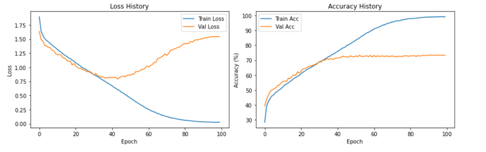

# Differential-ViT

## Overview
Differential-ViT leverages a novel approach to attention mechanisms by introducing Differential Attention at its core.  
This model implementation aims to evaluate the performance of Differential Attention in a Vision Transformer across a wide range of image recognition tasks.

Progress is being made, with training and evaluations performed on benchmark datasets.

---

## Repository Structure
```plaintext
├── diff_attn.py                  # Implementation of Differential Attention mechanism
├── Encoder.py                    # Transformer Encoder implementation
├── ViTDiff.py                    # Main script to train Differential-ViT
├── ViTDiff_CIFAR_10.ipynb        # Jupyter notebook for training and evaluation on CIFAR-10
├── ViTDiff_MNIST.ipynb           # Jupyter notebook for training and evaluation on MNIST
├── VitDiff_predictions.png       # Visualization of model predictions
├── img.png                       # Example training visualization for MNIST
├── image_1.png                   # Attention map visualization for MNIST
├── img_1.png, img_2.png          # CIFAR-10 training visualizations
├── img_3.png                     # CIFAR-10 attention map
├── img_4.png, img_5.png          # Oxford Pet dataset visualizations
```

---

## Datasets and Results

### MNIST Dataset
Differential-ViT demonstrates excellent performance on the MNIST dataset, serving as a baseline for testing core functionality.  
**Benchmark:** Verify near-perfect test accuracy (≥ 99%) after 50 epochs.  
#### Results:
- Epochs: 50  
- Test Accuracy: **99%**

  


---

### CIFAR-10 Dataset
The CIFAR-10 dataset evaluates the model's performance on more challenging natural image classification tasks.  
**Benchmark:** Achieve at least 80% test accuracy after 150 epochs using advanced augmentations and proper regularization.  
#### Results:
- Epochs: 150  
- Test Accuracy: **75% thus far**  

  
  
  

---

### Oxford Pet Dataset
The Oxford Pet Dataset evaluates the model's fine-grained classification capabilities.  
**Benchmark:** Target at least 60% test accuracy after 100 epochs by fine-tuning with a learning rate of \(1e^{-5}\) and leveraging transfer learning from pretrained weights.  
#### Results:
- Epochs: 100  
- Test Accuracy: **15% thus far**

  
  

---

## Future Work
To further benchmark and improve Differential-ViT:
- Conduct experiments on more diverse datasets (e.g., ImageNet, CelebA).
- Integrate task-specific adaptations such as multi-scale features for object detection.
- Visualize and analyze Differential Attention maps on complex datasets to better understand the mechanism’s effectiveness.
- Conduct ablation studies comparing Differential Attention with standard self-attention mechanisms.

---

